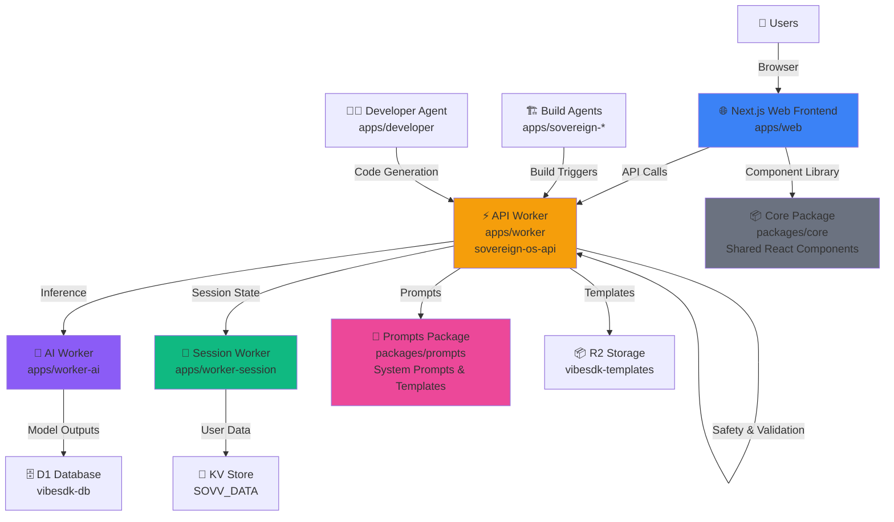

# SOVV Monorepo Architecture & Dependencies

## 📊 High-Level Architecture



## 🔄 Data Flow

### User Request → Response

```
1. User Request (Browser)
   ↓
2. Next.js Web Frontend (apps/web)
   - Renders UI using @sovereign/core components
   - Calls API Worker endpoints
   ↓
3. API Worker (apps/worker - sovereign-os-api)
   - Validates request (safety.ts)
   - Applies rate limiting
   - Routes to service workers
   ↓
4. Service Workers (depending on request type)
   - AI Worker: LLM inference
   - Session Worker: State management
   ↓
5. Data Storage
   - D1 Database: Structured data
   - KV Store: Session cache & counters
   - R2 Buckets: Templates & artifacts
   ↓
6. Response back to Web Frontend
   ↓
7. UI Update (React components from packages/core)
```

## 📦 Package Dependencies

### Build Order (Topological Sort)

```
1. packages/core
   └─ No dependencies (foundational)

2. packages/prompts
   └─ No dependencies (foundational)

3. apps/worker
   ├─ depends on: packages/prompts (system prompts)
   └─ used by: apps/worker-ai, apps/worker-session (service calls)

4. apps/worker-ai
   ├─ depends on: apps/worker (API definitions)
   └─ independent worker (parallel deployment)

5. apps/worker-session
   ├─ depends on: apps/worker (API definitions)
   └─ independent worker (parallel deployment)

6. apps/web
   ├─ depends on: packages/core (UI components)
   └─ calls: apps/worker (API)

7. apps/developer, apps/sovereign-build-agent, apps/sovereign-code-agent
   └─ independent workers (parallel deployment)
```

## 🔌 Inter-Service Communication

| From | To | Purpose | Protocol |
|------|-----|---------|----------|
| `web` | `worker` | API calls | REST/fetch |
| `worker` | `worker-ai` | AI inference | Service binding |
| `worker` | `worker-session` | Session mgmt | Service binding |
| `worker` | `developer` | Code generation | Service binding |
| `worker` | `sovereign-build-agent` | Build triggers | Queue/HTTP |
| `worker` | `sovereign-code-agent` | Code analysis | Queue/HTTP |

## 🗂️ File Organization

```
SOVV/
├── apps/                          # All applications
│   ├── web/                       # Next.js frontend
│   │   ├── app/                   # Next.js App Router
│   │   ├── public/                # Static assets
│   │   ├── scripts/               # Deploy scripts
│   │   └── wrangler.toml          # Cloudflare Pages config
│   │
│   ├── worker/                    # Main API Worker
│   │   ├── src/
│   │   │   ├── index.ts           # Worker entry point
│   │   │   ├── safety.ts          # Risk detection & validation
│   │   │   ├── prompts.ts         # System prompts (1000+ lines)
│   │   │   ├── __tests__/         # Unit tests
│   │   │   └── ...
│   │   ├── wrangler.toml          # Worker config (DB, KV, R2 bindings)
│   │   └── package.json
│   │
│   ├── worker-ai/                 # AI/LLM inference worker
│   │   ├── wrangler.toml
│   │   └── src/
│   │
│   ├── worker-session/            # Session management worker
│   │   ├── wrangler.toml
│   │   └── src/
│   │
│   ├── developer/                 # Developer agent
│   ├── sovereign-build-agent/     # Build automation
│   ├── sovereign-code-agent/      # Code analysis
│   └── sovereign-vibe/            # VibeSDK (broken build - TODO: fix)
│
├── packages/                      # Shared code
│   ├── core/                      # React components & utilities
│   │   ├── src/
│   │   │   ├── index.ts           # Main export
│   │   │   ├── components/        # Memory, Pattern, Timeline, etc.
│   │   │   ├── hooks/             # Custom React hooks
│   │   │   ├── utils/             # Helpers
│   │   │   └── types/             # Shared TypeScript types
│   │   └── package.json           # Exports as @sovereign/core
│   │
│   └── prompts/                   # System prompts & templates
│       ├── src/
│       │   ├── system-prompts/    # Base system prompts
│       │   ├── templates/         # Prompt templates
│       │   └── versions/          # Version history (future)
│       └── package.json           # Exports as @sovereign/prompts
│
├── .github/workflows/
│   ├── deploy.yml                 # Main CI/CD pipeline
│   └── ...
│
├── docs/
│   ├── ARCHITECTURE.md            # This file
│   ├── SETUP_GUIDE.md             # Per-app setup instructions
│   ├── DEPLOYMENT.md              # Deployment runbooks
│   └── TROUBLESHOOTING.md         # Common issues
│
├── scripts/                       # Utility scripts
├── .env.example                   # Environment template
├── pnpm-workspace.yaml            # Monorepo config
├── turbo.json                     # Turbo build orchestration
├── package.json                   # Root package config
└── README.md                      # Getting started
```

## 🚀 Deployment Flow

```
Git push to main
    ↓
GitHub Actions triggers deploy.yml
    ↓
1️⃣ TypeScript Check (blocking)
   ├─ Type-check: apps/worker
   └─ Tests: apps/worker
    ↓ (must pass to continue)
    ↓
2️⃣ Parallel Deployments
   ├─ Deploy API Worker (sovereign-os-api)
   ├─ Deploy Session Worker (worker-session)
   ├─ Deploy AI Worker (worker-ai)
   ├─ Deploy Web App (sovv-web via OpenNext)
   ├─ Deploy Developer Agent
   ├─ Deploy Build Agent
   └─ Deploy Code Agent
    ↓
All live at:
├─ API: https://api.defrag.app
├─ Web: https://defrag.app
└─ Workers: https://<name>.defrag.workers.dev
```

## 🔐 Security Boundaries

### Public (Cloudflare Pages)
- `apps/web` — Next.js frontend
- Static assets in `/public`

### Private (Cloudflare Workers)
- `apps/worker` — Main API (auth required)
- `apps/worker-ai`, `worker-session` — Service-to-service only
- Database, KV, R2 — Bindings (no direct access)

### Authentication Flow
```
1. User logs in via Web UI
2. Web app gets JWT token
3. Token sent with API requests
4. Worker validates token (JWT signature)
5. Token grants access to user's data
```

## 📈 Scaling Considerations

### Bottlenecks
- **Worker cold starts**: ~50ms (typical Cloudflare)
- **Database queries**: D1 limits (see Cloudflare docs)
- **KV operations**: ~10ms latency
- **AI inference**: Dependent on model (can be 1-5s)

### Optimization Opportunities
- [ ] Cache frequently-accessed templates in KV
- [ ] Batch database queries
- [ ] Parallel worker deployments (already in CI)
- [ ] Turbo remote caching (in progress)
- [ ] Request deduplication for AI inference

## 🔗 Related Documentation

- [Setup Guide](./SETUP_GUIDE.md) — Per-app configuration
- [Deployment Runbook](./DEPLOYMENT.md) — How to deploy
- [Troubleshooting](./TROUBLESHOOTING.md) — Common issues
